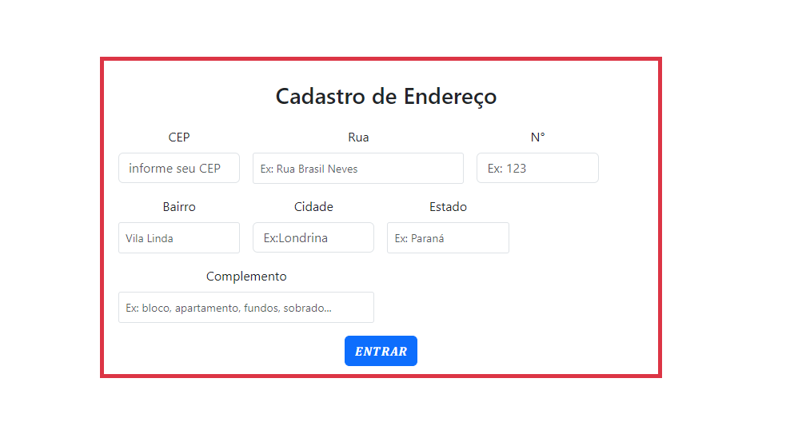
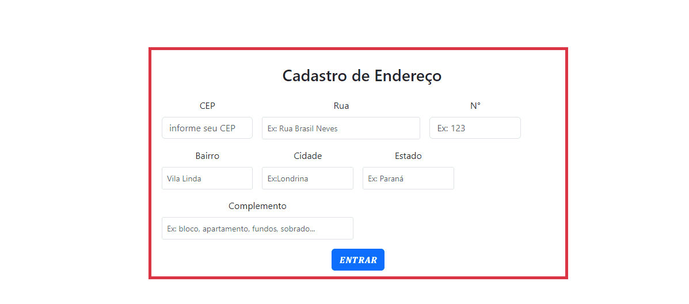

<h1 align="center">PROJETO DE CADASTRO PARA ENDEREÇO </h1>

<h2 align="center">🚀 COMEÇANDO </h2>

## DESCRIÇÃO

#### Este projeto consiste em um formulário para cadastro de endereços que utiliza a API do ViaCEP para preencher automaticamente os campos com informações de endereço a partir do CEP informado pelo usuário, o código é escrito em JavaScript.

## <h2 align="center">⚙️ QUAIS SÃO AS FUNCIONALIDADES? 💻</h2>

* Limpa o formulário ao iniciar a pesquisa.
* Valida se o CEP informado possui somente numéros e se possui 8 dígitos.
* Utiliza a API do ViaCEP para preencher os campos de endereço com as informações correspondentes ao CEP inserido.
* Exibe mensagens de alerta ao usuário em caso de erro, como CEP inválido ou não encontrado.
* *HasOwnProperty:* é um método em JavaScript que verifica se um objeto tem uma propriedade específica que é dele, sem considerar as propriedades herdadas de outros objetos. 
* *AWAIT:* faz a execução de uma função async pausar, para esperar pelo retorno da Promise , e resume a execução da função async quando o valor da Promise é resolvido
* *ASYNC:* As funções Async/Await são uma maneira de escrever código assíncrono em JavaScript de uma forma mais lógica e legível.
* *JSON:* O formato JSON (JavaScript Object Notation) é, como o nome sugere, uma forma de notação de objetos JavaScript, de modo que eles possam ser representados de uma forma comum a diversas linguagens.
* *FOCUSOUT:* é acionado quando um elemento perde o foco. Isso acontece, por exemplo, quando o usuário clica fora do campo de input ou navega para outro campo. É uma forma de detectar que o usuário terminou de interagir com o campo específico.

<h2 align="center">⚙️ FERRAMENTAS UTILIZADAS</h2>

* JavaScript 
* Use Strict
* Expressões Regulares (Regex)
* API

<h2 align="center">📎REFERÊNCIAS</h2>

[HasOwnProperty](https://developer.mozilla.org/en-US/docs/Web/JavaScript/Reference/Global_Objects/Object/hasOwnProperty)

[ASYNC](https://www.locaweb.com.br/blog/temas/codigo-aberto/javascript/#:~:text=As%20fun%C3%A7%C3%B5es%20Async%2FAwait%20s%C3%A3o,para%20lidar%20com%20opera%C3%A7%C3%B5es%20ass%C3%ADncronas)

[JSON](https://www.alura.com.br/artigos/o-que-e-json?utm_term=&utm_campaign=%5BSearch%5D+%5BPerformance%5D+-+Dynamic+Search+Ads+-+Artigos+e+Conte%C3%BAdos&utm_source=adwords&utm_medium=ppc&hsa_acc=7964138385&hsa_cam=11384329873&hsa_grp=164240702375&hsa_ad=703853654617&hsa_src=g&hsa_tgt=aud-396128415587:dsa-2276348409543&hsa_kw=&hsa_mt=&hsa_net=adwords&hsa_ver=3&gad_source=1&gclid=EAIaIQobChMIs-KXxLfyiAMVMgaHAx0j0xT6EAAYASAAEgK5sPD_BwE)

[AWAIT](https://developer.mozilla.org/pt-BR/docs/Web/JavaScript/Reference/Operators/await)

[FOCUSOUT](https://developer.mozilla.org/pt-BR/docs/Web/API/Element/focusout_event)

<h2 align="center">🖊️ AUTORES </h2>
# Autora
[Maria Eduarda Yanagui Silva](https://github.com/MariaYanagui/)

# Colaborador 
[Guilherme Serafim](https://github.com/Guilimas2)

